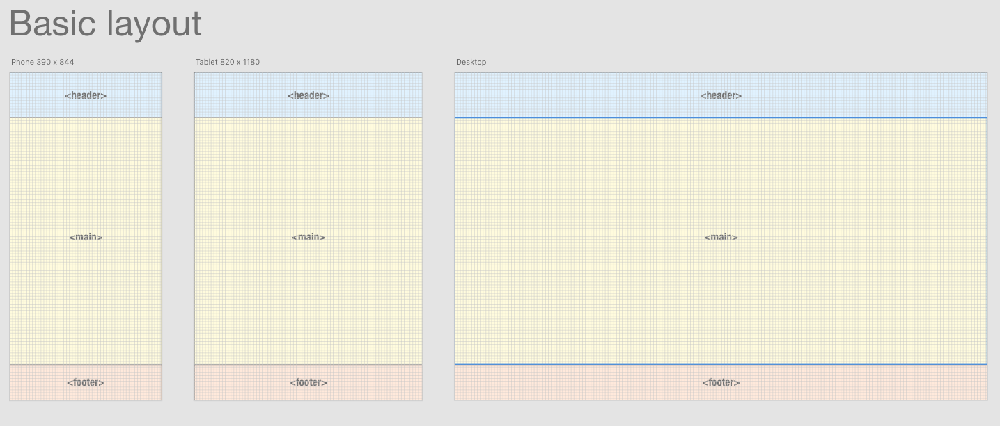
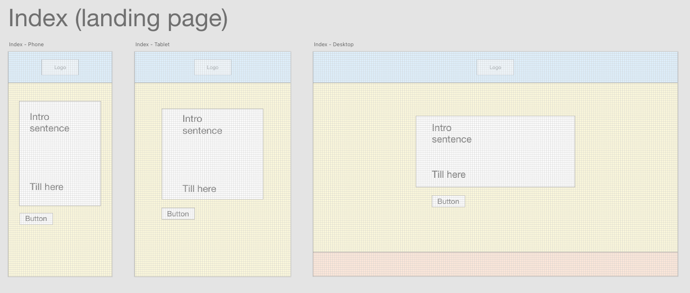
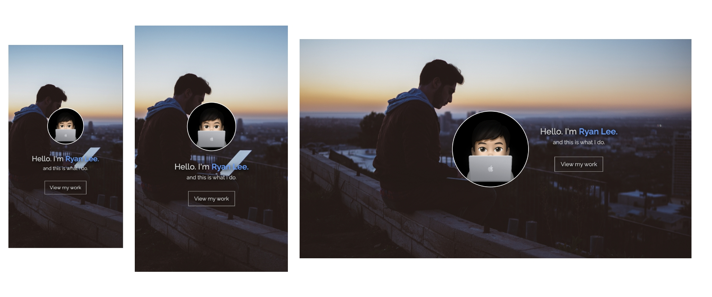
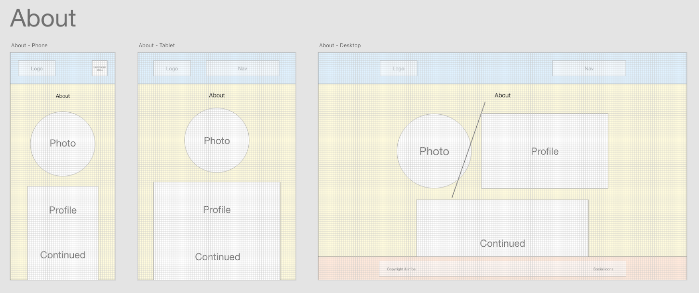
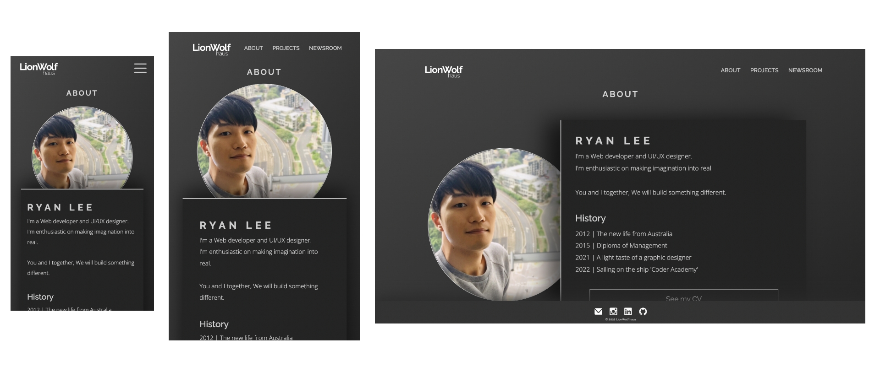
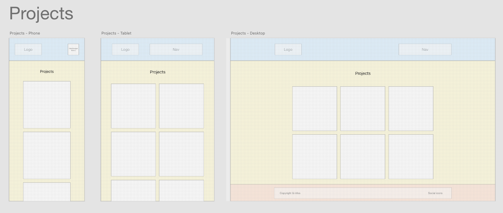
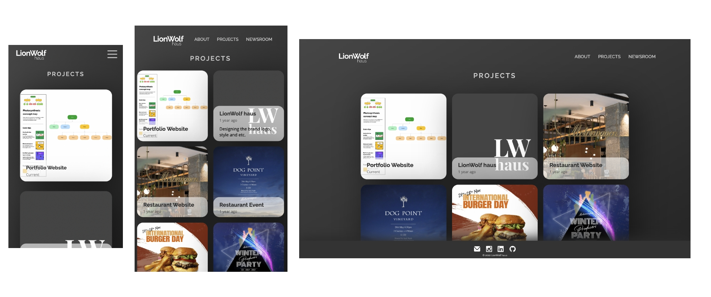
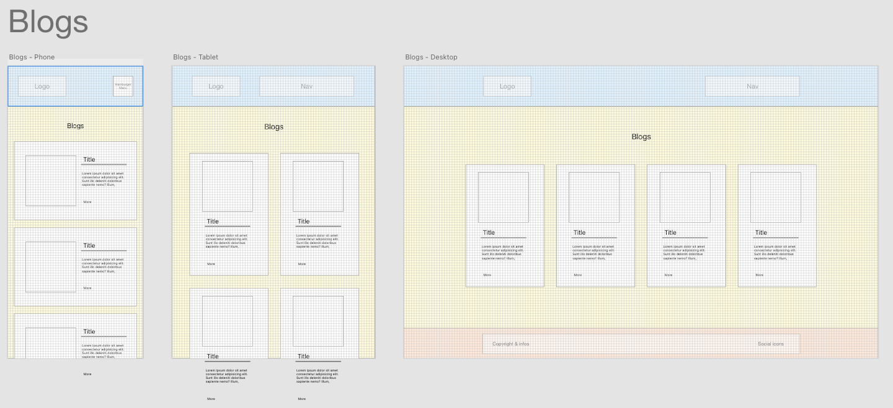
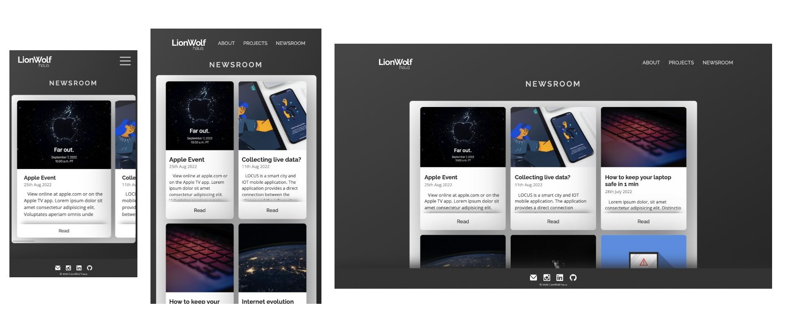
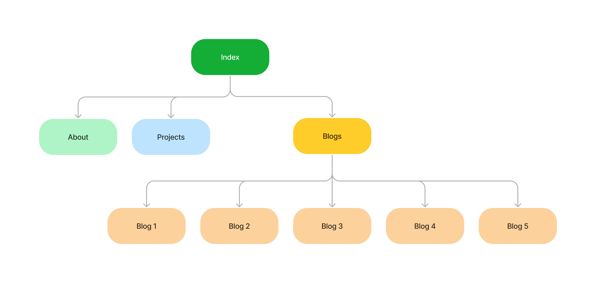

# T1A2 Portfolit Website project by Chang-Ha Lee

## [Portfolio Website](http://lionwolfhaus.netlify.app)

## [Video Presentation](https://vimeo.com/manage/videos/743882385)

## [GitHub Repo](https://github.com/RyanWoolf/ChanghaLee_T1A2)

## Purpose and target audience

The portfolio website is to provide an online portfolio that provides information about me, my skills, interest, professional knowledge and a shocase of my work. Especially, as I'm interested in Graphic Design including UI/UX, I have tried my best to implement well-balanced theme.

The target audience for my portfolio website is a potential employer looking to engage not only for a dev and/or IT professional but also UI/UX design.

## Functionality and features

The website is built with full of semantics, responsive layout for devices with different screen sizes and complex selectors which can make CSS styling shorter but also more functional. It has simple but classic design with dark colour theme. It comes with 4 pages;

- Index/Landing page : The landing page that the visitors will see the first. It goes with a short greeting including a memoji of myself and a button which has colour changes when hover. The whole window screen, regardless of the size, is filled with a image and the greeting area flexibly moving to better position avoiding stacking on the background model.

- About page : This page is filled with my actual profile photo, What i do, my history, Resume and my interest. The profile photo is coded to be placed under the profile content which has shadow property so it seems like it's acutually under the text content card. The photo and profile will flexibly move according to the size of screen. and at the bottom, it has 'my interest' box which have colours so they can have a bit of attention.

- Projects page : As i'm a IT student yet, i don't have actual experience on development. So I made a card gallery used on flexbox about my previous works with photos and short descriptions. The cards has hidden layer for texts, when the mouse cursor is hovering, the hidden part will come halfway up. When the cursor is out, it goes back.

- Newsroom page : This is the blog page. When 'Projects' page is consist of vertical gallery style, 'Newsroom' page is made on horizontal scroll snapping gallery. I didn't add hidden layers to show descriptions but linked to separate posing pages instead.

- Newsroom post page : This page has similar layout as Newsroom blog cards but has full content of the post.

- Etc. : Only with CSS, I have built the hamburgermenu for mobile vew only. Make 3 horizontal lines with tiny divs then make hovering menu hidden out of the screen with input type 'Checkbox' for conditional sliding down menu. Unfortunately it wasn't my original idea but it took a while to understand the mechanism and how to implement it on my website. 

## Sitemap
Created by Figma.

## Tech stack

- Wireframes : Figma
- Layout, Screenchots : Adobe XD
- Image editing : Adobe Photoshop, Adobe Illustrator
- Mock-up images : Figma
- Website : VS code
- Deployment : Netlify